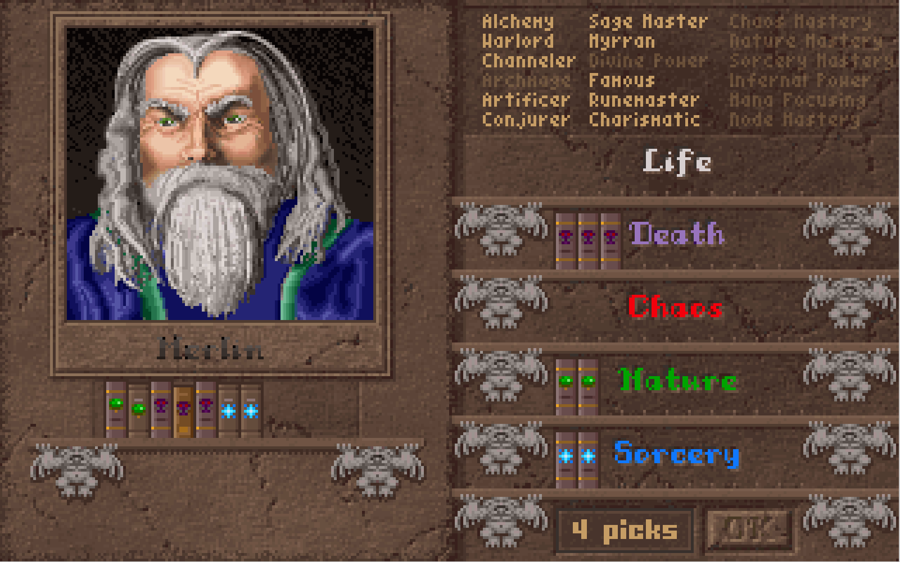

# Master of Magic clone

* Source language: golang, https://go.dev/
* Graphics library: ebiten, https://ebitengine.org/
* Master of Magic wiki: https://masterofmagic.fandom.com/
* Discord channel: https://discord.gg/xCpHBKrU9c

# Online demo

Play a wasm build of this game
https://kazzmir.itch.io/magic

Also try the combat simulator, which lets you test different battle situations
https://kazzmir.itch.io/magic-combat-simulator

# Build:

Extra packages needed for ebiten
https://ebitengine.org/en/documents/install.html

```
$ go mod tidy
$ go build -o magic ./game/magic
```
or
```
$ make
```

# Run:
Put the master of magic lbx files in one of the following places
- in the same directory as the game executable
- in any subdirectory of the directory the game executable is in
- in a zip file in the same directory as the game executable
- in a zip file in any subdirectory of the directory the game executable is in
- in a zip file and replace data/data/data.zip, then rebuild the game. This embeds the data into the executable. You can also put the unzipped lbx files in data/data/

Or use the `-data <path>` command line option to `magic` to specify either a directory that contains the lbx files or the `<path>` can be a zip file of the lbx files.
```
$ ./magic
```
or to run without building first
```
$ go run ./game/magic
```

# Music:

This game comes with a midi synthesizer built in, so the music should play with no issues. A default soundfont is included in data/data, but the soundfont is somewhat small. If you would like to use a different soundfont so that the music sounds better, then place a soundfont file (.sf2) into data/data or in the directory that the executable is in, or in /usr/share/sounds on linux.

Installing fluidsynth will provide a high quality soundfont, so that is one option. [fluidsynth](https://www.fluidsynth.org/)

# Screenshots:


# Directory layout:
- game/ Contains go code that implements the game functionality
- lib/ Supporting code used to load data/fonts/midi
- util/ Extra utility programs for development purposes (sprite viewer, font viewer, etc)
- data/ Put a zip file with the game data to embed the data in the final binary
- test/ Test programs for executing small pieces of functionality at a time

# Community:

Join the Discord server to discuss this project 

[Discord Channel](https://discord.gg/xCpHBKrU9c)
